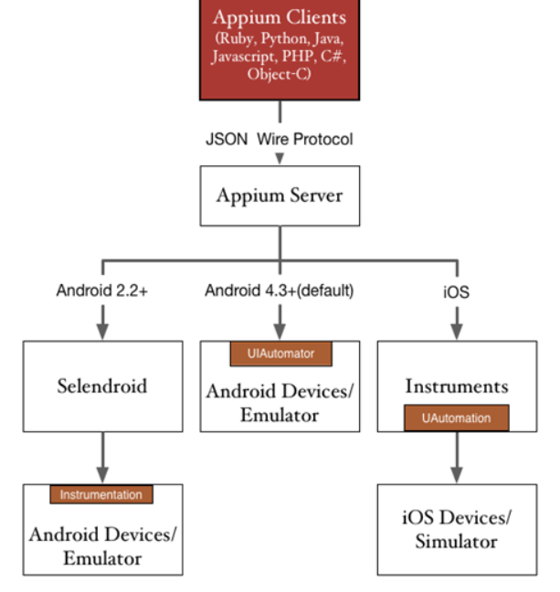
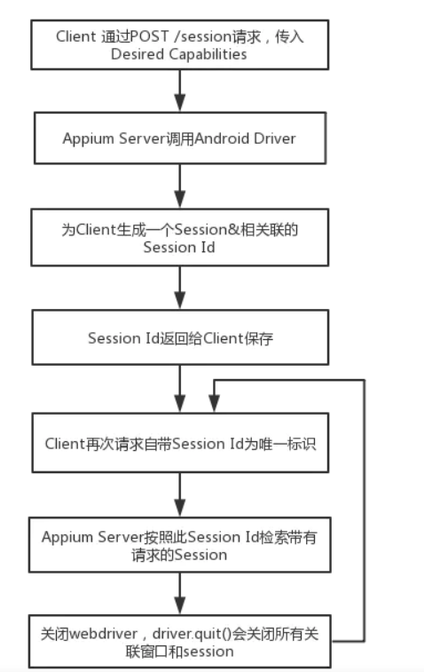

## 
### appium配置参数
http://appium.io/docs/cn/writing-running-appium/caps/
### 命令获取app信息
```commandline
adb shell pm list packages -3
aapt dump badging *.apk

```

### 原理图




### appium 使用平台自带的测试框架
- iOS 9.3 及以上: 苹果的 XCUITest
- iOS 9.3 及以下: 苹果的 UIAutomation
- Android 4.3+: 谷歌的 UiAutomator ，UiAutomator2（Android 5.0 (API Level 20) and above）
- Android 2.3+: 谷歌的 Instrumentation. (通过绑定独立的项目—— Selendroid 提供对 Instrumentation 的支持)
- Windows: 微软的 WinAppDriver
### 配置
```commandline
desire_cap = {}
desire_cap["platformName"] = "Android" 
desire_cap["deviceName"] = "1e4218b1" //当前的设备
desire_cap["appPackage"] = "org.suirui.huijian.video"
desire_cap["appActivity"] = "org.suirui.gbz.WelcomeActivity"
desire_cap["noReset"] = "true"
desire_cap["platformVersion"] = "10.0"  //当前的设备版本
```

### apk
用于存放待测apk目录
### runner
测试引用入口 
### testcase
测试用例脚本
### report
测试报告
### config
配置信息
### 主要的文件
- appium_start.py  app启动信息
- initHelper.py  元素读取方法
- log.py  日志工具
- baseAction.py 元素读取操作工具，如id,xpath等
- testrunner.py 批量执行测试脚本
- app_checklist.py 具体待测的测试脚本
- element.ini 存放元素的配置文件 如：首页 btnBack = org.suirui.huijian.video:id/btnBack
### iniHelper文件内容如下(读取ini配置文件工具类)
### 整体思路说明
- 使被测功能的脚本代码更加简洁，方便维护脚本，需要将测试数据与程序进行分离；
- 页面元素信息可以封装到配置文件中，并封装对应的读取配置文件的方法，在测试脚本需要使用时直接调用；
- 公共方法类，如：数据库连接配置信息及对数据库进行增删改查操作时，都可以封装到公共方法中，便于维护，使用时直接引用即可；
- 具体实际操作过程中，可以依据具体测试需求对框架作出相应的调整，目的是让脚本更加清晰化，且便于维护，易于推广给测试同行使用；

### 测试项目分类
- config层 - 放配置文件，采用yaml格式```pip install PyYaml``
- data层 - 放数据文件，可存放testcase的参数化相关的文件，一般用xlsx,xml,csv 等格式
- drivers层 -- 放所需的驱动(移动端暂时可不要)
- log层 - 放日志，可将日志分类，如运行时日志test log,错误日志error log
- report层 - 放程序运行生成的报告，一般可时html,excel报告等
- src 源码层 
  - test层 -- 放所有测试相关的文件，
    - case - 测试用例
    - common - 抽象通用代码 
    - page - 页面类 
    - runner -- 组织的测试套件
  - utils层 - 包括读取config的类，写log的类，读取excel,xml的类，生产报告的类等
```commandline
test
    |--case（用例文件）
    |--common（跟项目、页面无关的封装）
    |--page（页面）
    |--runner（测试套件，用来组织用例）

```
### 稳定性测试

### 
